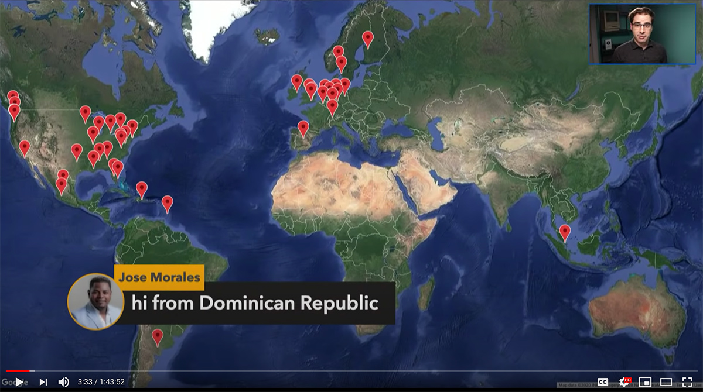

YouTube Chat Map
================

Show a map of where all your livestream viewers are from!

See an example of this in action: https://youtu.be/14ZhdSSZsWU?t=125

This works best if you instruct your viewers to "tell me where you're joining from, drop your city into the chat" or something.

This will strip out greeting words like "Hello from" and feed the remaining text into the Google geocoder and drop a pin on the map with the resulting location, and show their message on the screen.



NOTE: This is not terribly easy to set up right now, because it requires getting API keys from Google and configuring a bunch of settings in the Google Developer Console. Help is welcome in documenting those steps since it is a bit overwhelming unless you're already familiar with Google Web Services.


Setup
-----

Install dependencies using [Composer](https://getcomposer.org/download/):

```
composer install
```

Copy `.env.example` to `.env` and fill out the details. You'll need to get an API key for YouTube and Google Maps. Enter your channel name and that will also be removed from the messages people send to help get better quality locations from the chat.

You'll need to register an OAuth app and an API key with Google and fill out the credentials in the config file.

Run the app from the command line:

```
php -S 127.0.0.1:8080 -t public
```

Or deploy it to a web server and serve the `public` folder at the root of the domain.


Usage
-----

The first time you visit the page, you'll need to connect your YouTube account. Try to do this a few minutes before the livestream because the access token will expire in about an hour.

Then, paste in a YouTube video URL or video ID of the video that has live chat enabled. It will begin polling for new messages immediately.

Note that by default, Google developer accounts are limited to 10,000 API credits per day. Polling the YouTube chat costs a few credits per request, so this ends up draining the daily credits pretty quickly. It's best to close the browser once you have finished showing the map on the stream.

Visit `http://localhost:8080/reset.php` in your browser to reset the state so that you can reconnect everything from scratch when you use it next.


License
-------

Copyright 2020 by Aaron Parecki and contributors

Licensed under the Apache License, Version 2.0 (the "License");
you may not use this file except in compliance with the License.
You may obtain a copy of the License at

http://www.apache.org/licenses/LICENSE-2.0

Unless required by applicable law or agreed to in writing, software
distributed under the License is distributed on an "AS IS" BASIS,
WITHOUT WARRANTIES OR CONDITIONS OF ANY KIND, either express or implied.
See the License for the specific language governing permissions and
limitations under the License.
